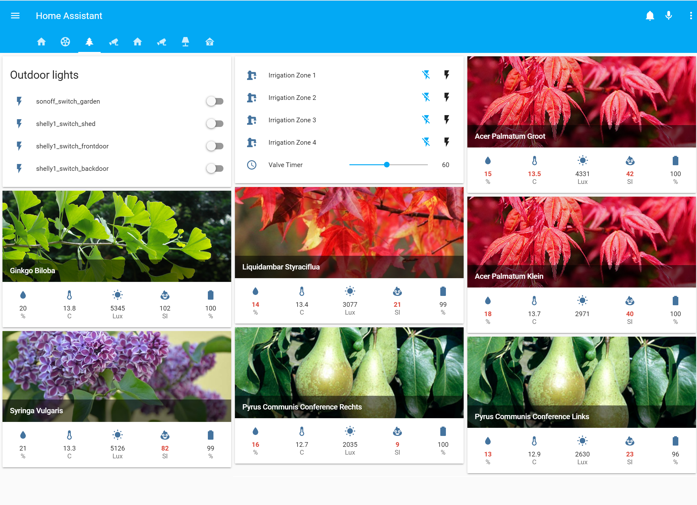

# garden-mqtt-deamon
This repo is a fork of the original work of RoyOltmans. Only instructions have been updated for a raspberry pi 3.

Garden control BLE Python rev 0.2

Description: Lightweight BLE mqtt deamon controller for garden with an Rasberry PI

All rights of the device are owned by Aqualin

This combination gives you the insight of zones (multiple miflora sensors) and can activate water delivery.

Many thanks to:
Kipe for building miplant https://github.com/kipe/miplant, I reused his project and combined it with aqaulin project to create the garden setup.

**Usage of this project is on your own risk.**

# Requirements
This project has been build on linux raspbian on a Raspberry Pi 3B.

0) Upgrade and update all repositories:

```
    $  sudo apt-get update
       sudo apt-get upgrade
       sudo apt-get dist-upgrade
```

1) Firstly install necessay utils

Install the required tool and libraries to support BLE:
```
    $  sudo apt-get install git bluetooth bluez
       sudo apt-get install python
       sudo apt-get install python-pip
``` 

2) A MQTT bus is needed install a MQTT bus (for example mosquitto) 
```
    $  sudo apt-get install mosquitto mosquitto-clients
```

Detailed description can be [found here](https://learn.adafruit.com/diy-esp8266-home-security-with-lua-and-mqtt/configuring-mqtt-on-the-raspberry-pi): 

3) Install necessary supporting libraries for the project
```
    $  sudo pip install paho-mqtt
       sudo pip install schedule
       sudo pip install mercurial
```

5) Install miflora requirements
For details see https://github.com/kipe/miplant
```
    sudo apt-get install python-pip libglib2.0-dev
    sudo pip install bluepy
```

6) Install garden mqtt deamon
```
    $  sudo git clone https://github.com/RoyOltmans/garden-mqtt-deamon.git /opt/garden-mqtt-deamon
```

7) We will need the MAC address(es) of the valve's, you can identify these by the following command:
```
    $  sudo hcitool lescan
``` 
write down the mac address of the valve(s) eg 01:02:03:04:05:06

Normally the address starts with 01:02:03:04:[XX]:[XX]

A example line would be
```
01:02:03:04:09:B6 Spray-Mist 09B6
```

Afterwards try connecting by using the following command:

```
gatttool -I
[                 ][LE]> connect 01:02:03:04:09:B6

```

Afterwards you get into a prompt, execute the following command:

```
[01:02:03:04:09:B6][LE]> char-desc
```

This should give a long list of ID's, if this works it should be "ok".

8) Configure the config.ini

Edit the config.ini via your favorite text editor (e.g. nano, vi etc). Change the mac address if you have one valve remove the whole line of mac addresses and the ','. Also change the MQTThost to the IP address or DNS name of the host running the MQTT bus (offcourse with extra details if needed).

```
sudo nano /opt/garden-mqtt-deamon/config.ini
```

# Usage

Set execution for the script

```
    $  sudo chmod +x /opt/garden-mqtt-deamon/garden-mqtt-deamon.py
```

Execute the script
```
    $  cd /opt/garden-mqtt-deamon
       ./garden-mqtt-deamon.py
```

Start a new bash instance and follow MQTT publications, use the following command below to follow the MQTT output
```
    $  mosquitto_sub -h [MQTT Host] -t '#' -v
```

To change the state of an aqualin device fill in the correct mac address (sranned with hcitool) and switch it on/of -m is the payload how long the valve will be openend before it closes again. The message for the off state does not have any functional affect.
```
    $  mosquitto_pub -h [MQTT Host] -t home/aqualin/[Aquilin BLE MAC]/status/on -m [payload, timer in minutes]
       mosquitto_pub -h [MQTT Host] -t home/aqualin/[Aquilin BLE MAC]/status/off -m [payload, timer in minutes]
```

After some late response I have added a requested feature and a repetitive check cycle for registered valve's.

You can manually provoke the service for a check via the following commands:
```
    $  mosquitto_pub -h [MQTT Host] -t home/aqualin/[Aquilin BLE MAC]/status/valve -m 'state'
       mosquitto_pub -h [MQTT Host] -t home/aqualin/[Aquilin BLE MAC]/status/valve -m 'timer'
```

The response will be via the following MQTT path with the Message payload below:
```
    home/aqualin/[Aquilin BLE MAC]/valvestate [state]
    home/aqualin/[Aquilin BLE MAC]/valvetimer [timer duration]
```

The valve state will be reported for all valve every 5 minutes.

This all van be optimized with more configuration items etc less hard coded (it's a quick and dirty project). I am thinking of porting the whole setup to a ESP in the future (keep you posted).

Hope this project helps with your garden automation. Offcourse this could be combined with miflora to control the valves via home-automation.

# Home Assistant example overview


